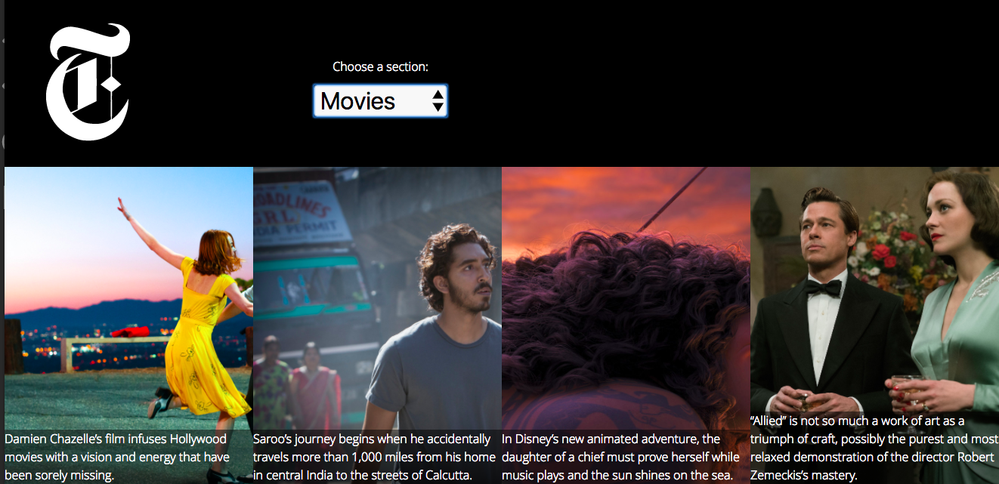

###InstaNews-Web-page

[--> See the actual website! <--](https://haninmustafa.github.io/InstaNews-Web-page/)

##About:
This is the second web page we do in Red Academy. It is about a website that gives the top stories from the New York Times API. we put the URL link using ajax format in javascript.

##Tools and Methods used:
*HTML
*CSS/SCSS
*Javascript
*jquery
*gulp
*heapbox plugin

##Overview:
For the structure layer HTML, it was pretty easy and simple to form. we connected all the stylesheept and script files to the HTML file.
For the design layer,CSS. we worked in this project with SASS and we transform the files to CSS using gulp. we separated the SCSS/SASS main file to many -scss files to make it easy to work with.
Ajax: we have learned how to call the data from an available API and then use this data in our website.

Gulp: is really useful setup and helped compile the .scss file into a properly minified and compiled .css file
